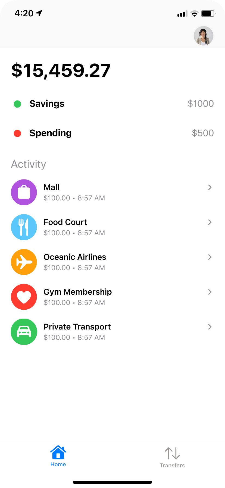
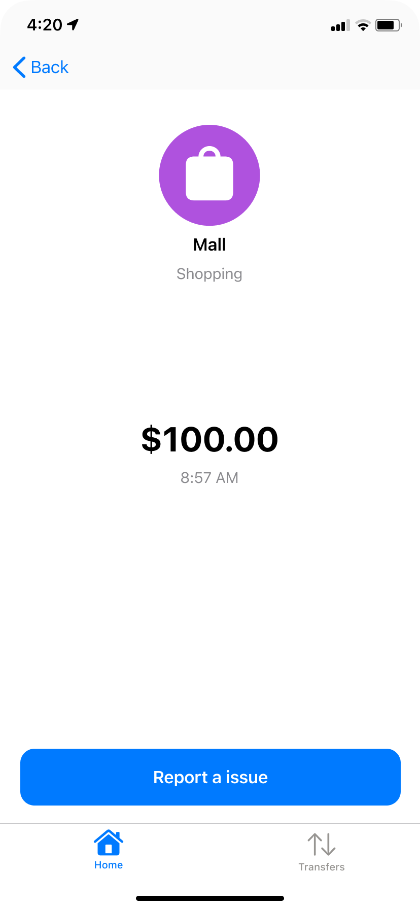
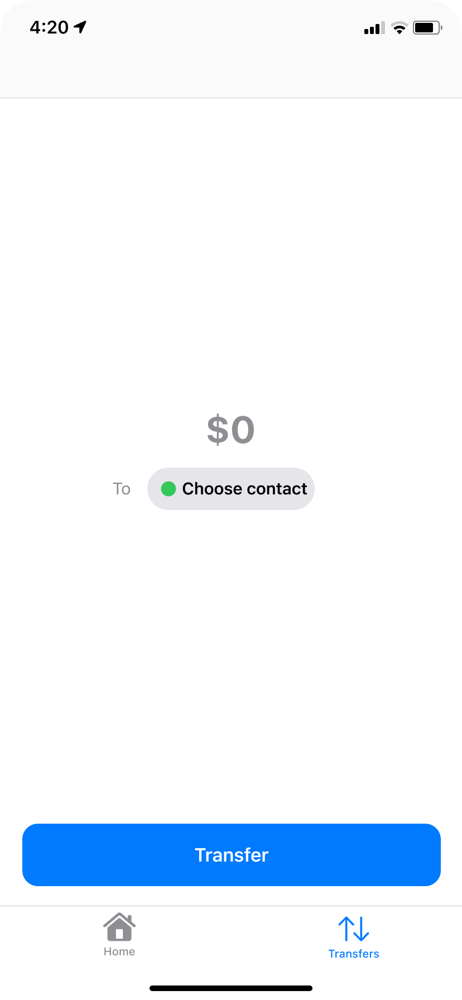
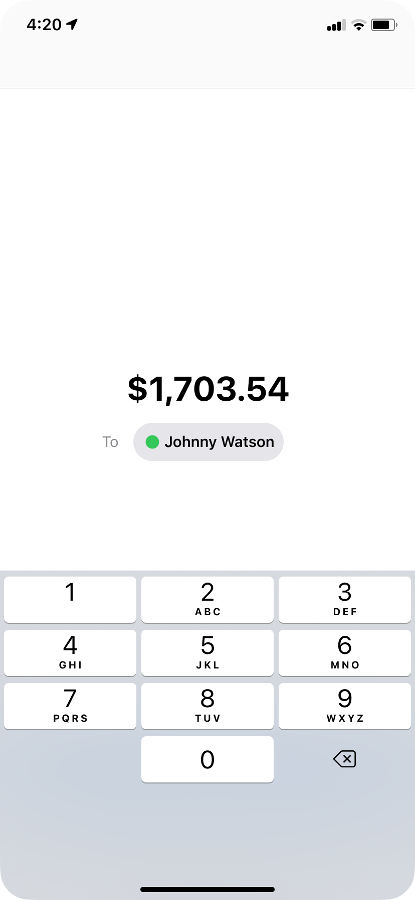
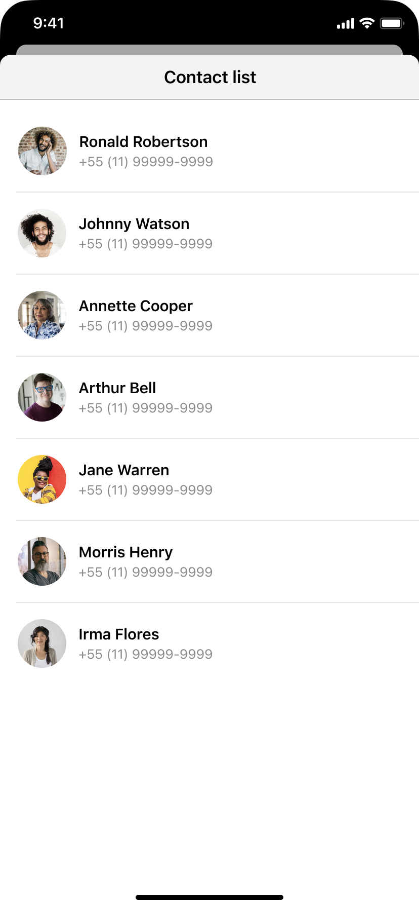

# VIPER Challenge - Finance App 💰

Neste desafio, aplicaremos conceitos da arquitetura VIPER para finalizar a implementação de um aplicativo. 

Desenvolveremos as diversas camadas que forma a arquitetura: Presenter, Interactor, Router e acesso à dados.

# Iniciando os trabalhos

1. Clone este repositório na sua máquina.
2. Abra a pasta `solutions` e acesse o projeto referente à sua Sprint.
3. Faça um build e rode o projeto. ▶️

# Funcionalidades tela a tela

Apesar do projeto base já estar funcional do ponto de vista de navegação e pronto para aplicarmos os conceitos da arquitetura VIPER, nada como entender o funcionamento esperado de cada uma das telas, e até mesmo, colocar alguns itens adicionais para o caso da Sprint estar caminhando de forma acelerada.

## 1. Home

Aqui temos a tela inicial do nosso app, abaixo o descritivo de montagem das células:
- Na navigation, temos a imagem de perfil do usuário
- A primeira linha deve apresentar o valor da propriedade *balance* da nossa API
    - Podemos usar essa primeira linha como o title de um section
- A segunda linha apresenta o atributo *savings*
- A terceira linha apresenta o atributo *spending*
- Em seguida temos uma section com a lista de objetos do atributo *activity*

Abaixo a lista de funcionalidades acessadas pela home:
- Ao tocar na imagem de perfil devemos abrir uma modal com o módulo *UserProfile*
- Ao tocar em uma activity deve fazer um push para o módulo *ActivityDetails*
- Ao tocar na aba Transfers, apenas mudamos a apresentação da aba, mostrando o módulo *Transfers* como root

> Regras adicionais (opcional)
- Enquanto a tela estiver aguardando o retorno da request, deve ser apresentado um estado de loading
    - Sugestões:
        - Usar componente Skeleton (facebook)
        - Criar uma view simples avisando que os dados estão sendo carregados
- Caso acontecer um erro na requisição da API ou no parse dos dados, deve ser apresentado um estado de erro

## 2. ActivityDetails

Tela sem muitos segredos, basicamento recebe os dados que serão apresentados da Home.

> Regras adicionais (opcional)
- No projeto base, o botão *report a issue* não possui nenhuma ação. Podemos criar um novo módulo com esta funcionalidade, e ao tocar no botão, fazemos um push para o móculo

## 3. Transfers

Tela para realizar uma transferencia de valores para contatos. A ideia é informar um valor, selecionar um contato da lista (apresentado em outro módulo) e então efetuar a transferencia tocando no botão *Transfer*.

Após efetuar a transação, seja com sucesso ou erro, o módulo *Confirmation* deve ser apresentado.

> Regras adicionais (opcional)
- Afim de exercitar a parte de regras de negócio, podemos pensar nos seguintes cenários:
    - Caso o valor informado for menor do que $10.00 apresentar mensagem de erro informando sobre este valor mínimo
    - Caso o valor informado seja acima de $1000.00 confirmar se o usuário deseja realmente prosseguir com essa transação
    - Caso o contato selecionado seja o Arthur Bell, apresentar mensagem de erro por bloqueio de segurança
        - Regra hardcoded mesmo
    - Caso o contato selecionado seja a Jane Warren nenhuma das regras acima se aplica
- Ao concluir a transação, apresentar a tela de confirmação conforme o status da transação, ou seja, caso tenha acontecido com sucesso, apresentar mensagem de sucesso, caso contrário, apresentar mensagem de erro na tela de confirmação.

## 4. ContactList

Tela simples para listagem de contatos do usuário. 

> Regras adicionais (opcional)
- Enquanto a tela estiver aguardando o retorno da request, deve ser apresentado um estado de loading
    - Sugestões:
        - Usar componente Skeleton (facebook)
        - Criar uma view simples avisando que os dados estão sendo carregados
- Caso acontecer um erro na requisição da API ou no parse dos dados, deve ser apresentado um estado de erro

## 5. UserProfile

Tela para apresentação dos dados do usuário. Aqui apresentamos os dados da API user_profile e também apresentamos a versão atual do app. 

# Sobre a Devpass

A Devpass é uma comunidade de pessoas desenvolvedoras de alto potencial acelerando suas carreiras através de desenvolvimento de produtos reais, como o Hereminders, e conexões com as principais lideranças de tecnologia do país, através de mentorias particulares e Tech Talks.

Se interessou? Acesse www.devpass.com.br e se inscreva na nossa lista para ficar por dentro das novidades!
